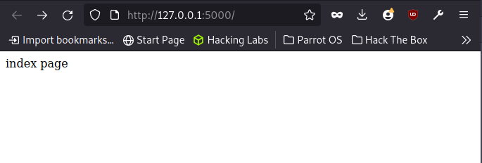
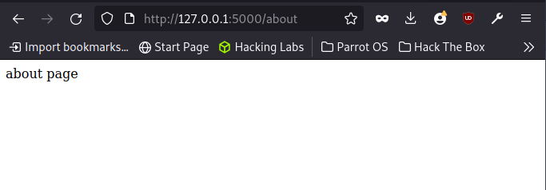

# Flask Routing.
In this module we will be taking a look at routing in flask.
In this mordern world we find ourselves in, it is important for your site to have meaningfull url so as when a user enjoys the content of that particular page, he can come back easily at any time. This can be achieved byt ensusing the parameter in the decorator function is easily readable. 
    eg.
    @app.route('/')
    def index():
        return 'index page'

    @app.route('/about')
    def about():
        return 'about page'

These subtle changes to our code can be visible when we start the app.

It is good practice to overall give readabale urls names.

