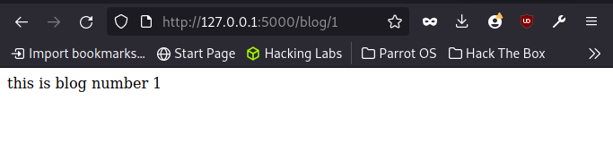

# Variable rule
Still on matters url, we cann go deeper and structure our urls to be more gynamic with adding variables to our urls.

We can add these varibales with <variable_name>. ensure that once you do this you do not forget to add it as a keyword argument in your function.

                THE CONVERSION TYPES
| TYPE    | EXPALANATION                                |
|---------|---------------------------------------------|
| STRING  | (default) accepts text without a slash      |
| int     | accepts positive interger values            |
| FLOAT   | accepts positive float values               |
| path    | operates similar to string but accepts slash|
| UUID    | accepts UUID values                         |

Optionally one can go a step further to even specify a converter eg <converter:variable_name>. Default is str so when using other datatypes ensure to use the converter. 

This is particularly useful when for example in a blog site and you want to retreieve the posts and each to have its own page.

eg:
@app.route('/blog/<int:blog_id>')
def blog(blog_id):
    return f'this is the blog number {escape(blog_id)}'

blog(1)

